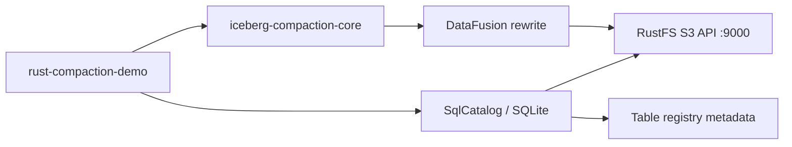

# rust-compaction-demo

Rust-native Apache Iceberg compaction demo: rewrites small Parquet data files
of an Iceberg table into fewer, larger files — entirely with a Rust runtime
(no JVM, no Spark). The table lives on [RustFS](https://github.com/rustfs/rustfs)
(local S3-compatible object storage) and table metadata is tracked in a local
SQLite-backed Iceberg catalog.

The compaction engine is
[nimtable/iceberg-compaction](https://github.com/nimtable/iceberg-compaction),
built on DataFusion and the
[risingwavelabs/iceberg-rust](https://github.com/risingwavelabs/iceberg-rust)
fork. For the AWS Glue + Amazon S3 variant of this demo, see
[*Getting started with Rust-Based Apache Iceberg Compaction Step by Step Guide*](<Getting%20started%20with%20Rust-Based%20Apache%20Iceberg%20Compaction%20Step%20by%20Step%20Guide.md>).

## What the binary does

1. Opens (or creates) a SQLite catalog database.
2. Loads the target table from the catalog; if the table is not registered
   yet, it discovers the table's metadata JSON on RustFS (Hadoop-style
   layout written by Spark/DuckDB) and registers it automatically.
3. Prints the current snapshot id.
4. Runs **full compaction** with a 128 MiB target file size through
   `CompactionBuilder`.
5. Commits a new Iceberg snapshot and reports input/output file counts
   and byte totals.

## Architecture



| Component | Role |
|---|---|
| `iceberg-compaction-core` | Compaction planning + DataFusion execution, snapshot commit |
| `iceberg-catalog-sql` | Iceberg catalog storing table registrations in SQLite |
| `iceberg-storage-opendal` (feature `opendal-s3`) | `StorageFactory` giving `FileIO` S3 access to RustFS |
| `sqlx` (`any` + `sqlite`) | SQLite driver for the catalog database |

### Two design constraints worth knowing

- **There is no `iceberg-catalog-s3` crate.** The S3 (Hadoop-style) catalog
  was removed from iceberg-rust; the fork only ships `glue`, `hms`, `loader`,
  `rest`, `s3tables`, and `sql` catalogs. This demo replaces it with the SQL
  catalog (SQLite) plus auto-registration of externally created tables.
- **All git dependencies must use the same revision.** `iceberg-compaction-core`
  pins `risingwavelabs/iceberg-rust` at rev `9827e78518603afa21e44bd14ca0bdcb32294e46`
  (iceberg 0.10.0). Any catalog/storage crate added here must be pinned to that
  exact rev, otherwise Cargo builds two copies of `iceberg` and every trait/type
  mismatches.

## Prerequisites

- Rust toolchain (edition 2024; the build was verified on 1.98).
- RustFS (or any S3-compatible store) running locally, default demo target:
  `http://127.0.0.1:9000`, credentials `rustfsadmin`/`rustfsadmin`,
  bucket `warehouse`.
- An Iceberg table already written into the warehouse by an external writer
  (e.g. Spark/DuckDB), laid out Hadoop-style:

  ```text
  s3://warehouse/<namespace>/<table>/metadata/<N>-<uuid>.metadata.json
  s3://warehouse/<namespace>/<table>/data/*.parquet
  ```

  With the defaults (`comet_poc.db` / `comet_bench_10m`) the expected prefix is
  `s3://warehouse/comet_poc.db/comet_bench_10m/metadata/`.

## Build

For day-to-day iteration, use the debug profile — it builds in seconds once
dependencies are cached (dependencies are still compiled with `opt-level = 2`,
so debug-run performance stays usable):

```shell
cargo check   # fastest: type-check only
cargo run     # debug binary, optimized dependencies
```

Build the optimized binary only when you need the final artifact:

```shell
cargo build --release
```

The release profile uses `lto = "thin"` with 16 parallel codegen units. (The
previous `lto = true` + `codegen-units = 1` re-optimized the entire
DataFusion/Arrow graph serially on every build — that was the source of the
multi-minute compile times.) Set `lto = false` if you want the fastest
possible release builds.

The first build takes several minutes (DataFusion, Iceberg, Parquet, AWS
stack); later builds reuse Cargo's cache. The binary lands at
`target/release/rust-compaction-demo`.

## Run

remove the existing catalog first

```shell
rm iceberg-catalog.db
rm iceberg-catalog.db-shm
rm iceberg-catalog.db-wal

```

```shell
ICEBERG_WAREHOUSE=s3://warehouse/ \
S3_ENDPOINT=http://127.0.0.1:9000 \
./target/release/rust-compaction-demo
```

On the first run you should see a registration line followed by the
compaction report:

```text
Registering table comet_poc.db.comet_bench_10m at s3://warehouse/comet_poc.db/comet_bench_10m/metadata/00001-....metadata.json
Current snapshot: 4102724506022755510
Compaction completed in 29s
Input files:  32
Output files: 1
Input bytes:  1073741824
Output bytes: 1073741824
```

### Connectivity-only dry run

```shell
DRY_RUN=1 \
ICEBERG_WAREHOUSE=s3://warehouse/ \
S3_ENDPOINT=http://127.0.0.1:9000 \
./target/release/rust-compaction-demo
```

### Configuration (environment variables)

| Variable | Default | Purpose |
|---|---|---|
| `ICEBERG_WAREHOUSE` | `s3://warehouse/` | Warehouse URI; table paths are derived from it |
| `ICEBERG_NAMESPACE` | `comet_poc.db` | Namespace as it appears on disk (Hive style uses a `.db` suffix) |
| `ICEBERG_TABLE` | `comet_bench_10m` | Table name |
| `S3_ENDPOINT` | `http://127.0.0.1:9000` | RustFS endpoint |
| `ICEBERG_CATALOG_DB` | `sqlite:iceberg-catalog.db` | SQLite catalog URI (file created if missing) |
| `ICEBERG_METADATA_LOCATION` | unset | Skip discovery; register this exact metadata JSON path |
| `DRY_RUN` | unset | `DRY_RUN=1` loads the table and prints snapshot info, then exits without compacting |
| `RUST_LOG` | `info` | `tracing-subscriber` filter |

S3 credentials are hardcoded to `rustfsadmin`/`rustfsadmin` for local
development — edit `src/main.rs` (or point `S3_ENDPOINT` at a real AWS/MinIO
setup and update the properties map) before using this anywhere else.

## How table registration works

The SQL catalog only knows about tables registered in its SQLite database.
If `load_table` fails with `TableNotFound`, `discover_metadata_location()`
resolves the current metadata JSON from the warehouse layout:

1. `metadata/version-hint.text` (Spark/Hadoop catalog convention) →
   `metadata/v<N>.metadata.json`, else
2. the highest-numbered `*.metadata.json` found by listing the metadata
   directory (handles both `v5.metadata.json` and
   `00001-<uuid>.metadata.json` naming).

The resolved path is then inserted into the catalog via
`catalog.register_table(...)`.

**Caveat:** registration snapshots the metadata location once. If an external
writer produces newer snapshots afterwards, this catalog keeps pointing at the
registered version. Delete the SQLite file (or set a fresh
`ICEBERG_CATALOG_DB`) to force re-discovery.

## Troubleshooting

| Symptom | Cause / fix |
|---|---|
| `no matching package named iceberg-catalog-s3 found` | That crate does not exist in the fork; use `iceberg-catalog-sql` pinned to the same rev as `iceberg-compaction-core` (see Architecture above). |
| `TableNotFound: ... comet_poc.db / comet_bench_10m` | Table not in the SQLite registry. Check `ICEBERG_WAREHOUSE`/`ICEBERG_NAMESPACE` match the real bucket layout; the demo now auto-registers, or set `ICEBERG_METADATA_LOCATION` explicitly. |
| `No table metadata found under s3://...` | Discovery searched the wrong prefix — verify the bucket/namespace/table path in RustFS, or pass the metadata JSON path directly. |
| 403/credential errors against RustFS | Confirm the access keys in `src/main.rs` match your RustFS admin credentials. |

## Notes on compaction

- Full compaction rewrites *all* current data files; it is the simplest plan
  to demonstrate but can repeatedly rewrite healthy files. A production
  scheduler should decide whether compaction is needed first.
- Compaction commits a new snapshot referencing the rewritten files; it does
  **not** delete old files. Expire old snapshots and remove orphans as a
  separate maintenance step.

## Project layout

```text
Cargo.toml                  # pinned git deps (must all share rev 9827e785...)
src/main.rs                 # catalog setup, metadata discovery, compaction run
iceberg-catalog.db          # created at runtime: SQLite table registry
```
